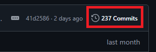
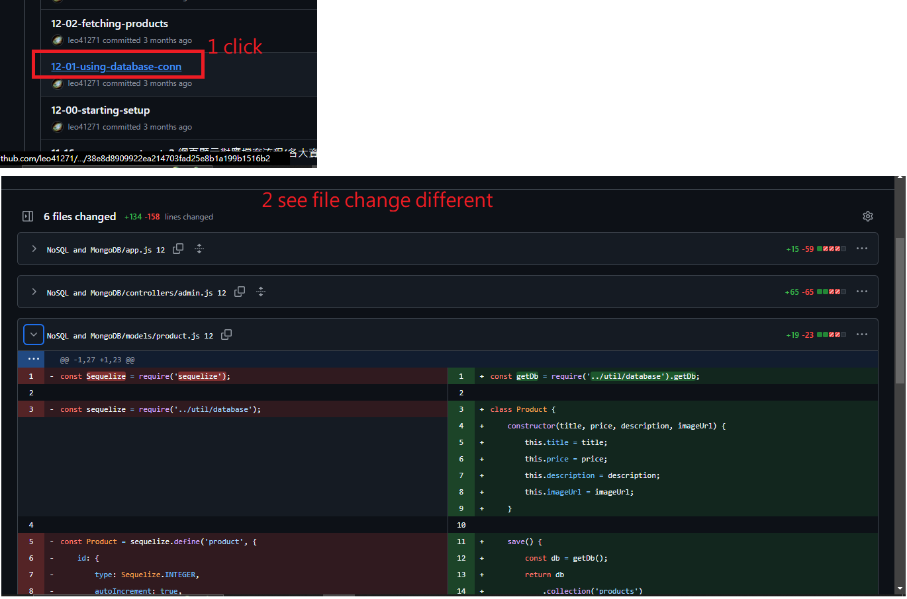
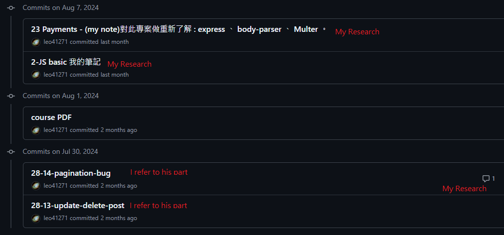
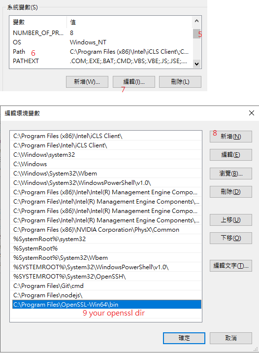
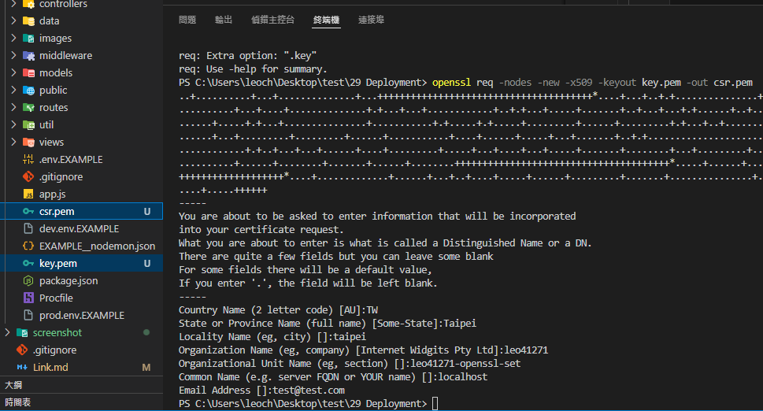

# how to use (Eng)

### [NodeJS - The Complete Guide (MVC, REST APIs, GraphQL, Deno)](https://www.udemy.com/course/nodejs-the-complete-guide/?couponCode=ST22MT92324B)

Basically, this repo mainly refers to here [node.js-complete-guide-2024](https://github.com/unsivilaudio/node.js-complete-guide-2024.)\
In general, I uploaded each chapter unit through git. If the commit message has a specific format like this `12-01-using-database-conn`
`(chapter -number -do-Some-thing)` is a reference to his part.\
please click here to see different.>>\
>>\

(Suppose you are currently reading Chapter 12 and have just finished the database connection. You can find the corresponding part to view.\
假設你目前看到第12章節 剛看完 database 連線 可找到對應的部分查看)

As for why I do this, it is because through git, I can better see the program differences that appear every time a part of the course is completed.
And I don't have to compare the differences in the entire project again. This saves me a lot of time.

but I personally don’t recommend running the code together every time(Just my personal opinion), because most of the time I don’t do it (this is partly due to efficiency issues, sometimes it takes too much time to follow it all, and I think the probability of encountering some parts in actual work is not very high and the efficiency is not high. In addition, I am not very friendly with English and other factors, which will take time).

The remaining part is my own notes (please refer to the table of contents), and my notes contain a very large number of links (most of them refer to official documents and are in English and a few are in Chinese).

By the way, there will be a `commit comment` in each Git commit, which is an additional comment I make through the web page after each `commit` action. You can also take a look if necessary(if helps).


# how to use (Eng) 中文 Chinese
基本上本篇的 repo 主要是參考這個人所釋出的 repo https://github.com/unsivilaudio/node.js-complete-guide-2024 。
整體而言我將 他每次的 章節單元 透過 git 上傳。 commit 訊息中如果是類似這樣具體格式的 
`12-01-using-database-conn`
`(chapter -number -do-Some-thing)` 則是參考他的部分。

至於為什麼我這樣做是因為透過 git 的方式可以更好的看到每一次課程做完一部分段落的功能時，所顯現的程式差異。\
而我不用再次比對整份專案的不同。這樣讓我省下很多時間，但是我個人並不建議每次程式碼都跟著一起跑(只是我的個人意見)，\
因為絕大部分我並沒有這麼做(這部分原因是效率問題，有時候都跟著做實在是太花費時間，並且有些部分在實際工作上遇到的機率我想並不是很高效益也不大，加上我對英文沒有到非常友好等等的因素 這些都要時間)。

後面剩下的部分則是我自己的筆記(可參看目錄)，並且我的筆記包含非常大量的 link (大多是參考到官方文檔且是英文 少許是中文)。\
另外有些 每次的Git commit 中 會有 `commit comment` 是我在每次 `commit`動作 之後 額外透過網頁的註解，如果有需要也可以看看。


below the rest of part is my note.

# Table of contents
+ [how to use](https://github.com/leo41271/node.js-complete-guide-2024-use-commit?tab=readme-ov-file#how-to-use-eng)
+ [23 Payments](https://github.com/leo41271/node.js-complete-guide-2024-use-commit?tab=readme-ov-file#23-payments)
+ [24 Rest Api](https://github.com/leo41271/node.js-complete-guide-2024-use-commit?tab=readme-ov-file#24-rest-api)
+ [CORS Cross-Origin Resource Sharing 政策 剖析](https://github.com/leo41271/node.js-complete-guide-2024-use-commit?tab=readme-ov-file#cors-cross-origin-resource-sharing-%E6%94%BF%E7%AD%96-%E5%89%96%E6%9E%90)
+ [25 Rest Application](https://github.com/leo41271/node.js-complete-guide-2024-use-commit?tab=readme-ov-file#25-Rest-Application)
+ [26 async function](https://github.com/leo41271/node.js-complete-guide-2024-use-commit?tab=readme-ov-file#26-async-function)
+ [27 Websockets](https://github.com/leo41271/node.js-complete-guide-2024-use-commit?tab=readme-ov-file#27-Websockets)
+ [28 GraphQL](https://github.com/leo41271/node.js-complete-guide-2024-use-commit?tab=readme-ov-file#28-GraphQL)
+ [29 Deployment](https://github.com/leo41271/node.js-complete-guide-2024-use-commit?tab=readme-ov-file#29-Deployment)
+ [SSL TLS 運作機制(Operating mechanism)](https://github.com/leo41271/node.js-complete-guide-2024-use-commit?tab=readme-ov-file#ssl-tls-%E9%81%8B%E4%BD%9C%E6%A9%9F%E5%88%B6)
+ [SSL setting in node.js (windows)](https://github.com/leo41271/node.js-complete-guide-2024-use-commit?tab=readme-ov-file#ssl-setting-in-nodejs-windows)
+ [30 Testing](https://github.com/leo41271/node.js-complete-guide-2024-use-commit?tab=readme-ov-file#30-Testing)
+ [31 build tool & npm intro](https://github.com/leo41271/node.js-complete-guide-2024-use-commit?tab=readme-ov-file#31-build-tool--npm-intro)
+ [32 ES modules vs CommonJS](https://github.com/leo41271/node.js-complete-guide-2024-use-commit?tab=readme-ov-file#32-ES-modules-vs-CommonJS)
+ [33 NodeJS Typescript](https://github.com/leo41271/node.js-complete-guide-2024-use-commit?tab=readme-ov-file#33-NodeJS-Typescript)
+ [34 35 Deno (skip not popular)](https://github.com/leo41271/node.js-complete-guide-2024-use-commit?tab=readme-ov-file#34-35-deno-skip-not-popular)
# 23 Payments  

23 章節以前的絕大部分(3 ... 23ch)都在此處。 
從23開始主要是因為 整個專案的完整性大約算是告一段落，不管是接觸到的各種概念和專案的架構等等。  
Most of the chapters before Chapter 23 (3~23ch) are here. \
Starting from 23 is mainly because the completeness of the entire project is relatively sufficient, whether it is the various concepts exposed, the structure of the project, etc.

## app.js
+ [express.js Eng](https://expressjs.com/)
+ [express.js zh-tw 繁體](https://expressjs.com/zh-tw/)
+ [express.js cn 簡體](https://www.expressjs.com.cn/)
+ + [app.use (5x)](https://expressjs.com/en/5x/api.html#app.use)(掛載指定的中間件 middleware 函數)
+ + [app.set (5x)](https://expressjs.com/en/5x/api.html#app.use)(Properties in the table 點入後往下查找表格 (views、view engine))
+ + [app.get (5x)](https://expressjs.com/en/5x/api.html#app.get.method)(app.get('/500', errorController.get500);)
+ + [express.static (5x)](https://expressjs.com/en/5x/api.html#express.static)(靜態檔案(static files)。靜態檔案通常指不需要伺服器端動態產生的資源，如 HTML 檔案、圖片、CSS 檔案、JS 檔案等。透過 express.static 中間件，你可以非常方便地將這些靜態資源提供給客戶端。)
+ + + [nodejs path.join](https://nodejs.org/api/path.html#pathjoinpaths)  
stackoverflow [What is the difference between __dirname and ./ in node.js?](https://stackoverflow.com/a/18283508/11493041)  
[__dirname](https://nodejs.org/docs/latest/api/globals.html#__dirname) in nodejs not global! >> [__dirname doc](https://nodejs.org/api/modules.html#modules_dirname)(請看 stackoverflow 以看出實際差異)

body-parser 是一個 Node.js 中間件，用於解析請求中的 body 資料  
+ [git body-parser](https://github.com/expressjs/body-parser)(API doc 都在這)
+ + [bodyParser Examples](https://github.com/expressjs/body-parser?tab=readme-ov-file#examples)
+ + [urlencoded](https://github.com/expressjs/body-parser?tab=readme-ov-file#bodyparserurlencodedoptions)
(是一種編碼資料格式，常用在 HTTP 請求中傳遞表單資料。當表單使用 `application/x-www-form-urlencoded` 編碼類型提交時，表單中的資料會被編碼成鍵值對形式，然後附加到請求的 URL 或作為請求的 `body` 傳遞。 extended : false  時 Express 使用 Node.js 內建的 querystring 模組來解析 urlencoded 資料 只能解析簡單的鍵值; true 時 使用 qs（Query String）庫，嵌套(多層)物件或陣列 都可解析) 。
+ + 在 Express 4.x 及更高版本中，body-parser 已經被整合到 Express 本身，因此你可以直接使用 express.json() 和 express.urlencoded() 來取代 body-parser 的功能 (5x基本都有了)

Multer 是一個 Node.js 中間件，專門用來處理 multipart/form-data，這是用於上傳檔案的主要表單編碼類型，主要用於上傳文件檔案。是常見且強大的解決方案。
+ [git Multer](https://github.com/expressjs/multer)。[簡體中文 Multer](https://github.com/expressjs/multer/blob/master/doc/README-zh-cn.md) 從 Usage 開始看。
Multer 會新增 (body + (file or files) )物件 到 express 的 request物件中。body: 表單訊息 、 (file or files):上傳相關訊息。
+ + [DiskStorage](https://github.com/expressjs/multer?tab=readme-ov-file#diskstorage)(整篇文檔寫得很清晰 (需要幾乎整個doc都要看掉)。 file extension 指的就是檔案的附檔名)

express-session 是在 Express 應用中管理使用者會話(session)的中間件。允許在伺服器端儲存使用者的data並在不同的請求之間保持狀態。對需要保持使用者登入狀態、處理使用者偏好設定或跨請求保存臨時數據的情況來說特別有用。
+ [express-session](https://github.com/expressjs/session)
+ + [secret](https://github.com/expressjs/session?tab=readme-ov-file#secret)(必填 用來簽名 session ID 的密鑰)
+ + [resave](https://github.com/expressjs/session?tab=readme-ov-file#resave)(Typically, you'll want false 讓他在有變更後才儲存)
+ + [saveuninitialized](https://github.com/expressjs/session?tab=readme-ov-file#saveuninitialized)( 跟上面一樣 不過是在初始化階段)
+ + [store](https://github.com/expressjs/session?tab=readme-ov-file#store)(儲存點、存到哪)>>以下相容的相關套件  
[![★][connect-mongodb-session-image] connect-mongodb-session][connect-mongodb-session-url] Lightweight MongoDB-based session store built and maintained by MongoDB. (另一個很相似 ★也較多的是 connect-mongo 但課程沒有用。 [Connection String](https://www.mongodb.com/docs/manual/reference/connection-string/#find-your-connection-string) 用於連接到 mongoDB Atlas 的官網doc)

[connect-mongodb-session-url]: https://github.com/mongodb-js/connect-mongodb-session
[connect-mongodb-session-image]: https://badgen.net/github/stars/mongodb-js/connect-mongodb-session?label=%E2%98%85

connect-flash 是一個用於 Express 應用中的中介軟體，允許你在使用者導向的訊息(如錯誤、警告、成功訊息等)之間傳遞資料，通常用於在重導頁面後顯示一次性訊息。
+ [connect-flash](https://github.com/jaredhanson/connect-flash)  
(With the flash middleware in place, all requests will have a req.flash() function that can be used for flash messages.)

cookie-parser 是一個用於 Express 應用中的中介軟體，用來解析 HTTP 請求中的 cookies 並使其可供你的應用程式使用。Cookies 是瀏覽器用來儲存資料的小型文字檔案，通常用於儲存使用者偏好設定、會話資訊或追蹤使用者活動等。
+ [cookie-parser](https://github.com/expressjs/cookie-parser)
(解析 Cookie 標頭並使用以 cookie 名稱為鍵的物件填入 req.cookies。)
+ + [res.cookie(name, value [, options])](https://expressjs.com/en/5x/api.html#res.cookie) 設定cookies內容

csrf  
youtube : [CSRF 攻击和防御 - Web 安全常识](https://youtu.be/gEPii2y3ISQ?si=j_gvxTJKMFUFmyDh) good source。  
前面 [15-06-adding-csrf](https://github.com/leo41271/node.js-complete-guide-2024-use-commit/commit/13ee5919c70a17a513611ceacf9ef6741a5c383f#comments) 這個篇章時 作者使用 [csurf](https://www.npmjs.com/package/csurf#example) `"csurf": "^1.11.0",` 已經被棄用，這裡改用 csrf-csrf 。
+ [csrf-csrf](https://github.com/Psifi-Solutions/csrf-csrf) 是透過[Double Submit Cookie Pattern.](https://cheatsheetseries.owasp.org/cheatsheets/Cross-Site_Request_Forgery_Prevention_Cheat_Sheet.html#alternative-using-a-double-submit-cookie-pattern) 方式實現 csrf 保護的，是 stateless無狀態 pattern。  
Dos and Don'ts (表示使用準的的縮寫: 可作 與 不要作)
其中的[配置 Configuration](https://github.com/Psifi-Solutions/csrf-csrf?tab=readme-ov-file#configuration)
```js
// 基本定義解構出來的屬性 
const {
    invalidCsrfTokenError, // This is just for convenience if you plan on making your own middleware.
  generateToken, // Use this in your routes to provide a CSRF hash + token cookie and token.
  validateRequest, // Also a convenience if you plan on making your own middleware.
  doubleCsrfProtection, // This is the default CSRF protection middleware.
} = doubleCsrf(doubleCsrfOptions);
    // 所以我們會看到 app.use(csrfProtection.doubleCsrfProtection); 但前面定義卻沒有。
```
Mongoose 是一個基於 Node.js 的 MongoDB 物件數據模型 (Object Data Modeling, ODM) 庫，它提供了一個在 Node.js 應用中對 MongoDB 進行操作的簡單而強大的方式。Mongoose 讓開發者可以用類似 SQL 的方式去定義和操作 MongoDB 的文檔數據模型，並且提供了豐富的功能來幫助處理數據的驗證、查詢、關聯等。
+ [mongoose homepage](https://mongoosejs.com/)
+ [git mongoose](https://github.com/Automattic/mongoose)
+ + [Support 問問題相關的支援](https://github.com/Automattic/mongoose?tab=readme-ov-file#support)  
+ [mongoosejs quick start](https://mongoosejs.com/docs/index.html) :  
1.With Mongoose, everything is derived from a [Schema](https://mongoosejs.com/docs/guide.html).  
1.5 Functions added to the `methods` property of a schema.  
2.compiling schema into a [Model](https://mongoosejs.com/docs/models.html).  
3.document can be saved to the database by calling its [save](https://mongoosejs.com/docs/api/model.html#Model.prototype.save()) method.  
4.[querying](https://mongoosejs.com/docs/queries.html) syntax filter the data we want

[top](https://github.com/leo41271/node.js-complete-guide-2024-use-commit?tab=readme-ov-file#table-of-contents)

## util/file.js
+ [node File System - unlink](https://nodejs.org/docs/latest/api/fs.html#fsunlinkpath-callback) fs.unlink(path, callback) 非同步 刪除指定路徑的檔案 ，callback 操作成功，物件將是 null

## routes/admin.js  
+ [express-validator](https://express-validator.github.io/docs) 基於 [Validator.js](https://github.com/validatorjs/validator.js)，提供了一組簡單而強大的工具，幫助開發者在處理用戶輸入時進行驗證和清理。
+ ★★★ [Guide express.Router](https://expressjs.com/en/guide/routing.html#express-router)<br>★★★ [手冊 express.Router](https://expressjs.com/zh-tw/guide/routing.html#express-router)
+ + [router.METHOD(path, [callback, ...] callback)](https://expressjs.com/en/5x/api.html#router.METHOD) <br>router.get 、 router.post 、 router.delete

## routes/auth.js  
+ [getting-started](https://express-validator.github.io/docs/guides/getting-started)  
1.一邊驗證 ， 2. 另一邊透過 validationResult(req) 處裡驗證 3. 最後(可選) 合乎匹配者 matchedData(req) 至少專案沒有;
+ [.check api](https://express-validator.github.io/docs/api/check/#check)
+ [.body api](https://express-validator.github.io/docs/api/check/#body) 跟上面比 這個只會檢查 body 其他依樣畫葫蘆
+ + [Customizing express-validator](https://express-validator.github.io/docs/guides/customizing)  
+ + [.custom api](https://express-validator.github.io/docs/api/validation-chain#custom)  
```js
router.post('/login',[
        body('email')
            .isEmail()
            .withMessage('Please enter a valid email address.')
            .normalizeEmail(),
        body('password', 'Password has to be valid.')
            .isLength({ min: 5 })
            .isAlphanumeric()
            .trim(),
    ], // 這裡 的 [ ... ] 驗證結果 會被儲存於 下方 authController.postLogin。 .postLogin 方法的 req 之中
    authController.postLogin
);
```
`authController.postLogin` 的部分。
```js
const errors = validationResult(req);
    if (!errors.isEmpty()) {
        return res.status(422).render('auth/login', {
            path: '/login',
            pageTitle: 'Login',
            errorMessage: errors.array()[0].msg,
            oldInput: { email: email, password: password },
            validationErrors: errors.array(),
        });
    }
```

## middleware/is-auth.js
next() 一個重要的閘門機制讓流程繼續。  
[Guild - Writing middleware](https://expressjs.com/en/guide/writing-middleware.html)。[中文 撰寫中介軟體](https://expressjs.com/zh-tw/guide/writing-middleware.html)。  
`
Notice the call above to next(). Calling this function invokes the next middleware function in the app. The next() function is not a part of the Node.js or Express API, but is the third argument that is passed to the middleware function. The next() function could be named anything, but by convention it is always named “next”. To avoid confusion, always use this convention.
`

[top](https://github.com/leo41271/node.js-complete-guide-2024-use-commit?tab=readme-ov-file#table-of-contents)
## controllers/shop.js<br>
Stripe 是一個全球領先的在線支付處理平台，專門為企業和開發者提供簡單而強大的支付解決方案。它讓各類型企業能夠輕鬆地接受和管理在線支付，包括信用卡、借記卡、銀行轉賬以及其他支付方式。Stripe 支持全球多個國家和地區的業務，並且提供了廣泛的 API 和工具，讓開發者能夠將支付功能集成到他們的網站、移動應用和其他線上平台中。
+ [stripe.com](https://docs.stripe.com/) (台灣 中國區 無法註冊)
+ + + 解決辦法[stripe 申請](https://www.youtube.com/results?search_query=stripe+%E7%94%B3%E8%AB%8B) (流程很多繁雜，尚未申請)
+ [pdfkit](https://pdfkit.org/) (pdfkit 在 20-6 Upload Download 中)

## controllers/auth.js<br>
+ node [crypto.randomBytes](https://nodejs.org/api/crypto.html#cryptorandombytessize-callback) 內建
+ [bcryptjs](https://github.com/dcodeIO/bcrypt.js)  
[compare(s, hash,...)](https://github.com/dcodeIO/bcrypt.js?tab=readme-ov-file#compares-hash-callback-progresscallback)、
[hash(s, salt,...)](https://github.com/dcodeIO/bcrypt.js?tab=readme-ov-file#hashs-salt-callback-progresscallback)<br><br>
+ [SendGrid Official](https://www.twilio.com/docs/sendgrid) (no use in project)  
+ [nodemailer example](https://nodemailer.com/#example)  
+ [nodemailer-sendgrid-transport](https://github.com/sendgrid/nodemailer-sendgrid-transport?tab=readme-ov-file) > [Documentation](https://github.com/sendgrid/nodemailer-sendgrid-transport/blob/master/USAGE.md)
```js
const nodemailer = require('nodemailer');
const sendgridTransport = require('nodemailer-sendgrid-transport');
const tranporter = nodemailer.createTransport(
    sendgridTransport({
        auth: {
            api_key: '<<YOUR_API_KEY>>',
        },
    })
);
// ...
return tranporter.sendMail({
                to: email,
                /** MUST MATCH VERIFIED SENDER
                 *  ============================
                 *  see "Sender Authentication" in
                 *  Sendgrid dashboard
                 */
                from: 'test@test.com',
                subject: 'Signup succeeded!',
                html: '<h1>You sucessfully signed up!</h1>',
            });
```
[top](https://github.com/leo41271/node.js-complete-guide-2024-use-commit?tab=readme-ov-file#table-of-contents)
# 24 Rest Api

node - HTTP - [response.setHeader(name,value)](https://nodejs.org/api/http.html#responsesetheadername-value) (注意這裡的是node 核心模組的 方法 而不是 express.js 中的 static 中的選項 setHeaders )並且它會設定並更改(或新增)http的標頭資訊，且此時res還並未回傳回去它只是進行設定。  
MDN - [HTTP headers](https://developer.mozilla.org/en-US/docs/Web/HTTP/Headers) - [CORS](https://developer.mozilla.org/en-US/docs/Web/HTTP/CORS) [中文看這](https://developer.mozilla.org/zh-TW/docs/Web/HTTP/CORS) 之下
+ [Access-Control-Allow-Origin](https://developer.mozilla.org/en-US/docs/Web/HTTP/Headers/Access-Control-Allow-Origin) 普遍而言 多以設定 * ，除非限定ex 某域(源)下才有的開通服務 好讓所有的該域下的client 都能取得指定域(也就是來源)的資料。 
+ [Access-Control-Allow-Methods](https://developer.mozilla.org/en-US/docs/Web/HTTP/Headers/Access-Control-Allow-Methods)
+ [Access-Control-Allow-Headers](https://developer.mozilla.org/en-US/docs/Web/HTTP/Headers/Access-Control-Allow-Headers)

Youtube:  
[【跨域请求】【前端】什么是CORS ?](https://youtu.be/FF6zra7b7gM?si=HLvQN1TF5ku_Zfjl)  
[跨來源資源共用（Cross-Origin Resource Sharing, CORS）簡介](https://youtu.be/fcHDAciPPw0?t=215)影片中 3:35 對應到文檔的 [Origin 域](https://developer.mozilla.org/en-US/docs/Glossary/Origin) : the scheme (protocol), hostname (domain), and port.在同源(域)下三者必須完全匹配。  

next(); 前述有提到 ， 一個重要的閘門機制讓流程繼續。
並且是約定俗成命名 所以以下是可以的
```js
app.use((req, res, gg /* next */) => {
    res.setHeader('Access-Control-Allow-Origin', '*');
    res.setHeader(
        'Access-Control-Allow-Methods',
        'OPTIONS, GET, POST, PUT, PATCH, DELETE'
    );
    res.setHeader(
        'Access-Control-Allow-Headers',
        'Content-Type, Authorization'
    );
    gg(); // next();
});
// ---以下前端 拿取後端資料
postButton.addEventlistener('click', () => {
    fetch('http:///localhost:8089/feed/post'),{
        method: 'POST',
        body: JSON.stringify({
            title: 'A Codepen Post',
            content: 'Created via Codepen'
        }),
        headers: {
            'Content-Type': 'application/json'
        }
        // 在沒有JSON.stringify({... 。 
        // 預設下 Content-Type : text/plain
    }
})
```
[top](https://github.com/leo41271/node.js-complete-guide-2024-use-commit?tab=readme-ov-file#table-of-contents)
## CORS Cross-Origin Resource Sharing 政策 剖析:  
為了安全問題，基本上瀏覽器會檢查 來源是否 相同，不同則需要額外設定。  
怎樣算相同? => scheme(protocol), hostname (domain), and port 三者必須完全一致。  
對應的舉例 (http https) (yahoo.com google.com) (localhost:80 localhost:3360)  

當來源不同 CORS 這個機制 會利用額外的 標頭headers + [預檢請求proflight request](https://developer.mozilla.org/en-US/docs/Glossary/Preflight_request) 達成。  
在部分類別的請求中 約有兩類: 1.[簡單請求Simple requests](https://developer.mozilla.org/en-US/docs/Web/HTTP/CORS#simple_requests) 2.預檢請求。  

簡單請求不會 讓CORS 觸發預檢檢查。在這種情況下 CORS 的規範會讓瀏覽器檢查 server 回傳 res 是否帶有允許(包含)我們這個網域的認證=> Access-Control-Allow-Origin: * (*表示所有的網域都包含)， 如果server 那邊在經過路由的相關判斷允許有回傳就沒問題 (從不同源發送所回傳的 res 值可能會不同 ， * 只是表示server 沒有特別規範設定 ) 。

如果非簡單請求， CORS 規範的流程會事先檢查 預檢請求 完成後 再看 主要請求。  
預檢請求 的方法是 options 並且多了 Access-Control-Allow-Methods 、 Access-Control-Allow-Headers 資訊。  
預檢請求的作用 是在向server 先告知 等等會有個非 簡單請求 先告訴你，你接受了我再傳給你。所以為什麼會在F12 中看到network 都會有兩個請求就是如此。  

其他特別設定 附帶身分驗證的請求  
如果請求當中帶有 cookie 或其他，裡面會帶有一些個人訊息 預設下在跨域請求時為了安全問題將不會帶著身分資訊，如果此時還想帶著 cookie之類的東西來瀏覽 需要額外設定 => [Access-Control-Allow-Credentials](https://developer.mozilla.org/en-US/docs/Web/HTTP/Headers/Access-Control-Allow-Credentials) ， 且此時 Access-Control-Allow-Origin 將必須要是具體的， * 將會失敗。  

其他  
+ [Access-Control-Max-Age](https://developer.mozilla.org/en-US/docs/Web/HTTP/Headers/Access-Control-Max-Age) how long the results of a preflight request can be cached(被瀏覽器快取存多久).  
+ Access-Control-Expose-Headers : 客戶端可以去存到那些額外的標頭。

[top](https://github.com/leo41271/node.js-complete-guide-2024-use-commit?tab=readme-ov-file#table-of-contents)
# 25 Rest Application

+ [default error handler](https://expressjs.com/en/guide/error-handling.html#the-default-error-handler) 必須要有4個 才能確實辨別出 錯誤處理程序。  
+ [jsonwebtoken](https://github.com/auth0/node-jsonwebtoken)  
[jwt.verify()](https://github.com/auth0/node-jsonwebtoken?tab=readme-ov-file#jwtverifytoken-secretorpublickey-options-callback)  
[jwt.sign()](https://github.com/auth0/node-jsonwebtoken?tab=readme-ov-file#jwtsignpayload-secretorprivatekey-options-callback)

auth.js
```js
exports.login = (req, res, next) => // ...登入
User.findOne({ email: email }) // ... DB 尋找特定帳號 並驗證 ...
return bcrypt.compare(password, user.password); // ... 比對驗證結果
.then((isEqual) =>  // ... 拿取驗證登入密碼結果後 在後續進行判別
// ...
const token = jwt.sign( // 授予 1hr token 簽章
    { email: loadedUser.email, userId: loadedUser._id.toString() },
    'somesupersecretsecret',
    { expiresIn: '1h' }
);
res.status(200).json({
    token: token,
    userId: loadedUser._id.toString(),
});
```
is-auth.js
```js
const jwt = require('jsonwebtoken');
// ...
const token = authHeader.split(' ')[1];
// [0] : >> 依照設定 ex : Basic Bearer Digest ...
    let decodedToken;
    try {
        decodedToken = jwt.verify(token, 'somesupersecretsecret');
    } catch (err) {
        err.statusCode = 500;
        throw err;
    }
    if (!decodedToken) {
        const error = new Error('Not authenticated.');
        error.statusCode = 401;
        throw error;
    }
    req.userId = decodedToken.userId;
    next(); //最後確認 token 有過 繼續後續路由
```
參考 youtube jwtDoc: 
[JWT 驗證｜六角學院](https://youtu.be/0ZWo22vF4uU?si=jEEg0SWdV0dErduK)、[jwt.io](https://jwt.io/) [繁體中文](https://jwt.dev.org.tw/introduction)

```js
fetch('http://localhost:8080/auth/status', {
    headers: {
        Authorization: 'Bearer ' + this.props.token,
        // req.get('Authorization').split(" ")[0] : >> 依照設定 ex : Basic Bearer Digest ...
    },
})
```
HTTP headers - [Authentication](https://developer.mozilla.org/en-US/docs/Web/HTTP/Headers#authentication) - [Authorization](https://developer.mozilla.org/en-US/docs/Web/HTTP/Headers/Authorization)  
關於 為何約定俗成設定是=>> Bearer [Authentication schemes](https://developer.mozilla.org/en-US/docs/Web/HTTP/Authentication#authentication_schemes)

[top](https://github.com/leo41271/node.js-complete-guide-2024-use-commit?tab=readme-ov-file#table-of-contents)

# 26 async function
[async function](https://developer.mozilla.org/en-US/docs/Web/JavaScript/Reference/Statements/async_function#description)  
An async function declaration creates an AsyncFunction object. Each time when an async function is called, it returns a new Promise which will be resolved with the value returned by the async function, or rejected with an exception uncaught within the async function.  
當 async 函式被呼叫時，它會回傳一個 Promise。如果該 async 函式回傳了一個值，Promise 的狀態將為一個帶有該回傳值的 resolved。如果 async 函式拋出例外或某個值，Promise 的狀態將為一個帶有被拋出值的 rejected。

async/await 是`基於 Promise 的語法糖(簡化)`，它提供了一種更簡潔、更直觀的方式來處理異步操作。  
async 函數：在函數前加上 async 關鍵字，這個函數就會返回一個 Promise。  
await 關鍵字：只能在 async 函數中使用，await 用來等待一個 Promise 被解決（resolved）。它會暫停函數的執行，直到 Promise 返回結果，然後再繼續執行。  
錯誤處理可以使用 try/catch 來處理。

[top](https://github.com/leo41271/node.js-complete-guide-2024-use-commit?tab=readme-ov-file#table-of-contents)

# 27 Websockets
+ [git socket.io](https://github.com/socketio/socket.io)
+ [Socket.IO Doc](https://socket.io/docs/v4/)  
Socket.IO is a library that enables low-latency, bidirectional and event-based communication between a client and a server.  
Socket.IO 是一個函式庫，可在客戶端和伺服器之間實現低延遲、雙向和基於事件的通訊
+ [`Socket.IO is NOT a WebSocket implementation.`](https://socket.io/docs/v4/#what-socketio-is-not)  
儘管 Socket.IO 確實在可能的情況下使用 WebSocket 進行傳輸，但它為每個資料包添加了額外的元資料。
+ `Socket.IO` vs `WebSocket` 的區別?<br>
+ + [WebSocket](https://developer.mozilla.org/en-US/docs/Web/API/WebSockets_API) 是一種原生的網絡協議，定義在 RFC 6455 中。它允許在單一的 TCP 連接上進行全雙工通信，即客戶端和服務器可以同時發送和接收數據，而不需要建立多次連接。  
mdn doc : [WebSocket servers](https://developer.mozilla.org/en-US/docs/Web/API/WebSockets_API/Writing_WebSocket_servers)、[WebSocket client applications](https://developer.mozilla.org/en-US/docs/Web/API/WebSockets_API/Writing_WebSocket_client_applications)
+ + Socket.IO 是一個基於 WebSocket 的 JavaScript 庫(更高層的封裝)，但它不僅限於 WebSocket。它包括了 WebSocket 和其他技術（如在最基本連線中最低層級>HTTP long-polling），確保在任何網絡環境下都能夠建立穩定的連接(回退機制 自動降級到其他通信方式，確保通信的可靠性)。
額外功能:如自動重連、資料包緩衝、命名空間(多路復用Multiplexing)、房間功能(廣播)以及訊息確認(Acknowledgements)等，在構建複雜的實現更加方便。

## 運作原理 How it works
Server 和 Client 之間盡可能以 WebSocket 連線 ， 並以 HTTP long-polling 當作備案。

本質上 他分為兩個不同層級:  
+ 1. Engine.IO : Socket.IO 內部的引擎 (底層) : 處理傳輸 、
更新機制、斷線檢測  
+ + [處理傳輸Transports](https://socket.io/docs/v4/how-it-works/#transports) : HTTP long-polling 、 WebSocket  
+ + Handshake : Engine.IO 連線開始時，伺服器會傳送一些訊息  
+ + 升級機制 : 預設情況下，客戶端使用 HTTP 長輪詢傳輸建立連接(因為User 體驗 故注重連線可靠)
+ + 斷線檢測Disconnection detection : HTTP request fails 、 WebSocket connection is closed 、 socket.disconnect() is called
+ 2. Socket.IO 本身(高級) : 讓你可以達到前面說的 額外功能的作用。  

### Server Initialization
注意不同環境下的配置不同，其中 http 與 express 的配置有點類似 差別在 後者多了 express 的實例當作引數使用。  
+ `使用`[Express](https://socket.io/docs/v4/server-initialization/#with-express)`之下的初始設定` 這裡專案透過另外將 socket 初始設定分離。
```js 
const express = require("express");
const { createServer } = require("http");
const { Server } = require("socket.io");
const app = express();
const httpServer = createServer(app);
const io = new Server(httpServer, { /* options */ });
io.on("connection", (socket) => {
  // ...
});

httpServer.listen(3000);
```
server
+ [Handling CORS](https://socket.io/docs/v4/handling-cors/)  
+ Events [Emitting events](https://socket.io/docs/v4/emitting-events/)  

client
+ Initialization : [different domain](https://socket.io/docs/v4/client-initialization/#from-a-different-domain)
```js
const socket = io("https://server-domain.com"); // Doc
const socket = openSocket('http://localhost:8080'); // frontend project use "action in value ['create','update','delete']" control by backend 
        socket.on('posts', (data) => {
            if (data.action === 'create') {
                this.addPost(data.post);
            } else if (data.action === 'update') {
                this.updatePost(data.post);
            } else if (data.action === 'delete') {
                this.loadPosts();
            }
        });
```
server side
```js
io.getIO().emit('posts', { action: 'update' // ... 'create', 'delete' })
// 這裡的 getIO 主要就只是為了要取得實體 instance 來 使用 io 本身的各種功能方法
```
上述基本流程:
1. server: socket.emit("xxx")
```js
io.getIO().emit('posts' //...通知所有連接的客戶端有新的資料更新
```
2. client: socket.on("xxx",()=>{ ... }) 
```js
socket.on('posts', (data) => { // ...監聽從後端發送的事件 post 。
```
3. client: socket.emit("yyy")
```js
// ...專案中沒有
```
4. server: socket.on("yyy",()=>{ ... })
```js
io.on('connection', (socket) => { // ...不過這裡只是用來確認當有客戶端連線時進行基本的處理。例如日誌輸出(如果需要)。沒有明確的例子表明後端正在監聽特定的事件
```
+ 專案中主要為 後端向前端推送資料更新的情境 1 2步驟。即被動地監聽來自後端的通知（使用 socket.on('posts', ...)）。

[top](https://github.com/leo41271/node.js-complete-guide-2024-use-commit?tab=readme-ov-file#table-of-contents)

# 28 GraphQL
+ [GraphQL](https://graphql.org) 。[GraphQL 中文](https://graphql.cn/)  
+ Learn > Introduction > see [`the available training courses`](https://graphql.org/community/resources/training-courses/) (Community > Resources > Training Courses) :
> 1. [`GraphQL Tutorials`](https://hasura.io/learn/graphql/intro-graphql/introduction/)(也有中文) 

1. `GraphQL Tutorials`  

here have A. B. C. D. E. part.\
For part C, it is recommended to check the official website or teaching website. Just take a brief look.

A. [`GraphQL是?`](https://hasura.io/learn/graphql/intro-graphql/what-is-graphql/)

> request 透過字串 找尋 id 為 1 的資料 並且只要求 response 回傳 user 表的兩個欄位。  

1. GraphQL 查詢不完全是 JSON；只是看起来類似。Client 將其作為"字串"發送。  
2. Server 接收 JSON 物件 並根據 Graph 語法和 GraphQL 模式 將 已經從JSON物件提取出的 查詢字串符 進行處裡 驗證和Graph 查詢。
3. Server 抓取 Client 的 req 所要的資料。
4. 在向DataBase 或 其他service 拿到資料後 轉換成 JSON 物件 返回給 Client

B. [`GraphQL VS REST`](https://hasura.io/learn/graphql/intro-graphql/graphql-vs-rest/)  
REST API 的核心圍繞著資源。 資源由 URL 和請求類型（GET、POST 等）識別。  
GraphQL 則是可在`不同查詢下 得到不同的 JSON 資料`。  
+ GraphQL 的思維是:  
1. 對 同個 URL 返回的資料 進行 臨時查詢。  
2. POST 的內容 讓你描述你需要的資料的查詢 (沒有GET 方法了 就只有POST)  
3. 將 response 的資料當作一個圖表 ， 好讓你能查詢 ， 進而 抓取 相關的 局部資料。
4. POST 請求中作為資料發送的「查詢」含有結構和語法。 該「語言」稱為 GraphQL

簡單術語對照
Requirement | REST | GraphQL 
--- | :---: | :---: 
Fetching data objects | GET | query  
Inserting data | POST | mutation
Updating/deleting data | PUT/PATCH/DELETE | mutation
Watching/subscribing to data | &#10005; | subscription

`每個 GraphQL 請求，無論成功或報錯，都應傳回 200`，錯誤則作為回應中正文的一部分的 errors物件之下來進行處理。  

另外因為 express graphql automatically declines anything which is not a post or get request.
(只接收 get post 其他自動拒絕) 而這樣我們的 預檢請求 是 option 要讓他許可就必須要特別設置(此處觀念請參看 CORS )。  
在 Header 設置的部分另作配置 :
```js
    res.setHeader(
        'Access-Control-Allow-Headers',
        'Content-Type, Authorization'
    );
    if (req.method === 'OPTIONS') {
        return res.sendStatus(200);
    }
    next();
```

C. [`GraphQL 核心概念`](https://hasura.io/learn/graphql/intro-graphql/core-concepts/) 。 [Queries and Mutations](https://graphql.org/learn/queries/)  
GraphQL 請求字串的內容叫做 GraphQL 文檔 ( `GraphQL document` )
```graphQL
{
  author {
    id
    name
  }
}
```
`GraphQL 操作` 有三類型 query mutation subscription。  
A GraphQL document can contain one or more of these operations.
```graphQL
query { """operation type"""
  author { """operation endpoint"""
    id """request fields"""
    name """request fields"""
  }
} """文檔包含一個 '查詢' 操作。 在操作中可以選擇所需要的特定資料。"""
```
`Fields 字段` : 一個 GraphQL 字段描述一條獨立訊息。可表示資料之間的關係(可簡單或複雜)，操作中包含的全部内容都是字段。  
下面的另一個範例中除了作者字段，也有文章字段，也表示字段之間的關係。  
`Arguments 引數` : 可以出現在本文檔中的任何字段
```graphQL
query {
  author(limit: 5) { """這個 作者 字段 接收一個叫做 limit 參數 在此範例 引數則為 5""" 
    id
    name
    articles {
      id
      title
      content
    }
  }
}
```
`Variables 變數` : 在操作的 `頂部` 定義 ， 而變數的值以 Client 發送，格式通常是 Server 可以解的JSON格式。
```graphQL
query ($limit: Int) { """$limit: Int 變量宣告，名稱為 $limit，類型是 Int整數。"""
  author(limit: $limit) { """查詢中，author 字段接受一個參數 limit，它的值是來自變量 $limit"""
    id
    name
  }
}

"""JSON"""
{
  limit: 5
}
```
`Operation Name 操作名稱` : 多操作時會有順序性，下面為兩個操作
```graphQL
query fetchAuthor { """一個是抓取單一作者"""
  author(id: 1) {
    name
    profile_pic
  }
}
query fetchAuthors { """一個是抓取多個作者"""
  author(limit: 5, order_by: { name: asc }) {
    id
    name
    profile_pic
  }
}
```
`Aliases 別名` : 下面 帶有參數的字段中 不能再選擇集中出現兩次 故用別名
```graphQL
query fetchAuthor {
  author(id: 1) { """抓取作者資料"""
    name
    profile_pic_large: profile_pic(size: "large")
    profile_pic_small: profile_pic(size: "small")
  }
}
```
`Fragments`
```graphQL
fragment authorFields on author {
  id
  name
  profile_pic
  created_at
}

query fetchAuthor {
  author(id: 1) {
    ...authorFields """這種用法叫做 片段擴展"""
  }
}
query fetchAuthors {
  author(limit: 5) {
    ...authorFields
  }
}
```
`Inline Fragments` : 用於在查詢中處理多個可能類型（通常在使用介面或聯合類型時）(傳回多個不同的類型) 讓你可在不聲明下使用
```graphQL
query {
  search(query: "GraphQL") {
    ... on User {
      id
      username
    }
    ... on Article {
      id
      title
      content
    }
  }
} """依照返回的類型 直接對應"""
```
`Directives 指示` : 在不影響回應值的情況下新增附加功能的標識符，但會影響返回客戶端的回應  
標識符`@`後面可以跟一列已命名的參數。
- `@deprecated(reason: String)` - 將欄位標為已棄用  
- `@skip (if: Boolean)` - 跳過該欄位的 GraphQL 執行  
- `@include (if: Boolean)` - 如果為 true，則為帶有註解的欄位呼叫解析器。 
```graphQL
query ($showFullname: Boolean!) {
  author {
    id
    name
    fullname @include(if: $showFullname)
  }
}
```

D. [`How Does GraphQL Work With the Server?`](https://hasura.io/learn/graphql/intro-graphql/graphql-server/)
GraphQL servers are composed of two main parts:
1. Schema : defines what the API looks like
2. Resolvers : a function that specifies how to process a specific GraphQL operation and turn it into data.
+ 伺服器每次收到請求時，都會經歷以下步驟：
1. 解析文檔 
2. 確定要執行的 操作operation（如果有多個） 
3. 驗證請求，如果失敗則回傳錯誤 
4. 執行操作（查詢/變異/訂閱）

The most common way of writing a GraphQL server is by defining the schema and writing resolvers for the different operations and fields.  

`初始後端配置參考此`: [`GraphQL-JS tutorial`](https://graphql.org/graphql-js/)  
```js
app.all('/graphql', (req, res) =>
    grapqlHttp.createHandler({
        schema: graphqlSchema,
        rootValue: graphqlResolver,
        context: { req, res }, 
        formatError(err) { // graphql-http 。(427. Handling Errors)
            if (!err.originalError) { return err; }
            const data = err.originalError.data;
            const message = err.message || 'An error occurred.';
            const code = err.originalError.code || 500;
            return { message: message, status: code, data: data, };
        },
    })(req, res)
);
```
context: 提供給每個 resolver 並保存重要上下文資訊（例如目前登入的使用者或對資料庫的存取權）的值。這裡 context 物件 將作為 下方圖片 resolver 的 分別方法的例如
`createPost: async ({ postInput }, { req })` 第二個參數解構出來使用。  
`})(req, res)` 此處 是把(req, res) =>傳遞至此再給入到createHandler中介函式下的context裡面(來處理當前的請求和回應)。  
[formatError](https://graphql.org/graphql-js/error/#formaterror)

import版本問題 [express-graphql graphql-http/lib/use/express](https://github.com/graphql/graphql-http?tab=readme-ov-file#migrating-express-graphql)\
[express-graphql-explorer](https://npm.io/package/express-graphiql-explorer)


+ [28-01-first-query](https://github.com/leo41271/node.js-complete-guide-2024-use-commit/commit/e48121caf73828db27f658930c23b87bb604788f) 、 [28-02-mutation-schema](https://github.com/leo41271/node.js-complete-guide-2024-use-commit/commit/43a41142ac65fd6ea8f2867671833bfcc8fa6c63) 、 [28-03-mutation-resolver](https://github.com/leo41271/node.js-complete-guide-2024-use-commit/commit/b797dbde261b36cbcbfb69d3ead180a35cf118b6)


Those with the same symbols in the pictures represent the same concept
.png)

E. [`GraphQL Clients`](https://hasura.io/learn/graphql/intro-graphql/graphql-client/)
使用原生 JavaScript Fetch API 發出 GraphQL 請求
```js
const limit = 5; // 此處隨意舉例
const query = `query author($limit: Int!) {
    author(limit: $limit) { id name }
}`;
fetch('/graphql', {
  method: 'POST',
  headers: { 'Content-Type': 'application/json', 'Accept': 'application/json', },
  body: JSON.stringify({ query, variables: { limit }, })
}).then(r => r.json())
  .then(data => console.log('data returned:', data));
```
```js
// 專案中一些函式內。此處展示兩個例子 1. loginHandler 2. statusUpdateHandler
loginHandler = (event, authData) => {
event.preventDefault();
const graphqlQuery = {
  query: `
      query UserLogin($email: String!, $password: String!) { 
          login(email: $email, password: $password){
              token
              userId
          }
      }
  `,
  variables: { 
      email: authData.email,
      password: authData.password,
  },
};
this.setState({ authLoading: true });
  fetch('http://localhost:8080/graphql', {
      method: 'POST',
      headers: {'Content-Type': 'application/json',},
      body: JSON.stringify(graphqlQuery),
  }) 
  // .then((res) => { .....剩餘步驟與商業邏輯...
}
```
```js
statusUpdateHandler = (event) => {
event.preventDefault();
const graphqlQuery = {
    query: `
        mutation UpdateUserStatus($userStatus: String) {
            updateStatus(status: $userStatus){
                status
            }
        }
    `,
    variables: { userStatus: this.state.status, },
};
fetch('http://localhost:8080/graphql', {
    method: 'POST',
    headers: {
        Authorization: 'Bearer ' + this.props.token,
        'Content-Type': 'application/json',
    },
    body: JSON.stringify(graphqlQuery),
}) // .then((res) => { .....剩餘步驟與商業邏輯...
}
```

`GraphQL Introspection 内省(自我檢查)`
GraphQL query language is strongly typed.
它讓你有能力去查詢和理解 地層架構(underlying schema).
Server 公開以下有關Query操作類型的內省查詢。  
+ `__schema`  
+ `__type`  
+ `__typename` 請注意，內省查詢的開頭是`__`。  
query the field `__schema` field to find out the available `queries`, `mutations` and `types`  
為開發者提供了一種方式來探索和理解 API 結構。

[top](https://github.com/leo41271/node.js-complete-guide-2024-use-commit?tab=readme-ov-file#table-of-contents)
# 29 Deployment

[How to read environment variables from Node.js](https://nodejs.org/en/learn/command-line/how-to-read-environment-variables-from-nodejs)
```env
# .env file
PORT=3000
MONGO_USER=leo41271
MONGO_PASSWORD=yourpassword
MONGO_DEFAULT_DATABASE=shop
STRIPE_KEY=sk_test_wertyukkjhgfdxcvbnuikomnbv
```
```js
// index.js
console.log("777"); // node index.js >> 777 undefined undefined undefined undefined
console.log(process.env.PORT); // node --env-file=.env index.js >> will get values of ".env" file (dev.env prod.env plz run another script below)
console.log(process.env.MONGO_USER);
console.log(process.env.MONGO_PASSWORD);
console.log(process.env.STRIPE_KEY);
```
remove to `package.json` to run `npm run use-env`script
```json
  "scripts": {
    "test": "echo \"Error: no test specified\" && exit 1",
    "use-env" : "node --env-file=.env index.js",
    "dev-env" : "node --env-file=dev.env index.js",
    "prod-env" : "node --env-file=prod.env index.js" // here have 3 files !!
  },
```
console or bash ... run code
```bash
npm run use-env
777
3000
leo41271
9u4biljMQc4jjqbe
sk_test_T80E02SHDZQLwk4TYtrWlsat
```
and last add `*.env`  to  .gitignore file
```.gitignore
*.env
```
[helmet npm](https://github.com/helmetjs/helmet): 主要是加些資訊在http標頭防止一些常見的網路各種攻擊或設定  
注意專案的語法已經過時，詳情參照 [Content-Security-Policy](https://github.com/helmetjs/helmet?tab=readme-ov-file#content-security-policy)。\
[Content Security Policy (CSP)](https://developer.mozilla.org/en-US/docs/Web/HTTP/CSP)\
[compression npm](https://github.com/expressjs/compression): 對 response 的 body 進行壓縮。  
```js
app.use(compression({
  threshold: 1024, // 只壓縮超過 1KB 的回應
  filter: (req, res) => {
    if (req.headers['x-no-compression']) {
      return false; // 客戶端標頭要求不壓縮
    }
    return compression.filter(req, res); // 默認的壓縮過濾器
  }
}));
```
[morgan npm](https://github.com/expressjs/morgan)記錄每個進入伺服器的 HTTP 請求的詳細資訊(日誌)，方便開發者在開發或除錯過程中查看請求記錄。
其他參考: [How to Get Node.js Logging Right](https://blog.risingstack.com/node-js-logging-tutorial/)
```js
const accessLogStream = fs.createWriteStream(
    path.join(__dirname, 'access.log'), { flags: 'a' } // 存放 log 檔
);
app.use(morgan('combined', { stream: accessLogStream }));
// 有三個選項 immediate skip stream 專案只用第三個選項
```
[top](https://github.com/leo41271/node.js-complete-guide-2024-use-commit?tab=readme-ov-file#table-of-contents)
## SSL TLS 運作機制
TLS 為新一代的SSL ， 但現今大家還是習慣稱呼 TLS 為SSL。  
通信間為了 資料的安全性 我們會將其加密。  
所以為了要知道通信資料，我們會需要解密，故 後端我們會有 公鑰 私鑰。  

公鑰顧名思義，不用保護，私鑰永遠只有伺服器知道，    
因為私鑰稍後將被用來解密資料，公鑰將用於加密。  
現在在ssl憑證中，我們將該公鑰綁定到伺服器身份，  
身分是網域名稱、管理員電子郵件地址之類的東西、當您在設定憑證時所設定的內容。  
ssl憑證會連接公鑰和伺服器 並發送該證書 到前端、到瀏覽器，  
以便客戶端也知道公鑰並知道它屬於到該伺服器。  
通常您將使用機構頒發憑證，但您也可以建立自己的 ssl 憑證。  
但是當您創建自己的密鑰時，瀏覽器實際上並不相信您那裡的信息是正確的，  
你可能會看到"嘿此頁面使用ssl 但似乎不安全"之類的資訊或警告。  
因此，在生產中，您將使用已知憑證機構頒發所提供的 ssl 憑證並且被瀏覽器信任。  
但兩者基本運作方式是相同的。  
理想下憑證會由受信任的機構創建。  
我們擁有該公鑰，該證書的一部分，我們將在這裡自己創建它，因為這是免費的，  
然後客戶端透過該憑證接收該公鑰，現在客戶端可以加密它發送到伺服器的數據，伺服器可以使用該私鑰解密數據，並且只有該私鑰才能解密該數據。  

[top](https://github.com/leo41271/node.js-complete-guide-2024-use-commit?tab=readme-ov-file#table-of-contents)
### SSL setting in node.js (windows)
MAC Linux 有預設的， windows 沒有。
1. windows 需要自己下載。\
[openSSL Binaries](https://wiki.openssl.org/index.php/Binaries) > `OpenSSL for Windows`
[Win32/Win64 OpenSSL Installer for Windows](https://slproweb.com/products/Win32OpenSSL.html)\
2.  下載後 cmd 裡面 openssl 還未被加到環境變數裡面。找到 openssl bin 所在的檔案目錄例如以下 `C:\Program Files\OpenSSL-Win64\bin` 將其加到環境變數中。
3. download VC_redist.x64 for C++ (if you don't have click yes(是) if you have it will not show)

4. go to ENV_VAR

5. set openssl to path\

5. click ok ... ok ... ok.
6. go to cmd test `openssl version` (vscode need to close and reopen)
```cmd
C:\Users\leoch>openssl version
OpenSSL 3.3.2 3 Sep 2024 (Library: OpenSSL 3.3.2 3 Sep 2024)
```
7. generate_key
```bash
# mac 的應該是如下(我是windows， mac 的我沒有很確定但可以試試)
openssl req -nodes -new -x509 -keyout -server.key -out server.cert
# windows 的應該是如下(我是windows)
openssl req -nodes -new -x509 -keyout key.pem -out csr.pem

### 其中 Common name 需要設定成你的域名 在這裡我們是 localhost 否則 將不會被接受
```

[openssl syntax 語法](https://docs.openssl.org/master/man1/openssl-req/)
```js
const https = require('https');
// ...
const privateKey = fs.readFileSync('key.pem'); // windows env
const certificate = fs.readFileSync('csr.pem');
// ...
https.createServer(
  { key: privateKey, cert: certificate },
  app
).listen(process.env.PORT || 3000);
```
<hr />

`Heroku 不在享有任何免費服務(not free)。` 替代品  [Render.com](https://render.com/)

[top](https://github.com/leo41271/node.js-complete-guide-2024-use-commit?tab=readme-ov-file#table-of-contents)
# 30 Testing

[TDD/BDD and Test Double 中文](https://medium.com/hobo-engineer/ricky%E7%AD%86%E8%A8%98-tdd-bdd-and-test-double-76eee9e75092)(include Unit test concept)\
[BDD/TDD/ATDD 中文](https://ithelp.ithome.com.tw/m/articles/10305119)

+ TDD Test-driven Development (測試驅動開發):
一種開發流程。TDD 是「先寫測試再開發程式」。
好處是開發者寫出測試時，就可以瞭解這一個元件/方法最後會怎麼使用，同時也釐清程式該怎麼設計。
整個開發流程會在單元測試、撰寫程式、重構三者間不斷循環，是一種有效提升程式品質的開發方法。
+ BDD Behavior-driven Development (行為驅動開發)
BDD 是 TDD 的進化版，除先寫測試再實作外，再多先寫規格，並且規格是一份「可以執行的規格」，也就是其程式語法描述接近日常口語，相當簡單易懂，也可以執行。也就是說比起 TDD ，BDD 更可以讓非技術人員一起參與討論，能讓使用者、測試人員與開發人員，可以用一樣的方式來描述與了解需求。

+ [Chai Doc](https://www.chaijs.com/)\
  [Chai Expect](https://www.chaijs.com/guide/styles/#expect)\
  [BDD expect/should API](https://www.chaijs.com/api/bdd/)\
  [.bind 使用在 throw 中](https://www.chaijs.com/api/bdd/#method_throw)

+ [Mocha Doc](https://mochajs.org/)。[Mocha中文](https://mochajs.bootcss.com/)\
  use [Assertions](https://mochajs.org/#assertions) in mocha\
  Asynchronous Code [done()](https://mochajs.org/#asynchronous-code)\
  [Hook](https://mochajs.org/#hooks) 

+ [Sinon](https://sinonjs.org/)\
  [sinon.stub](https://sinonjs.org/releases/v19/stubs/)

[top](https://github.com/leo41271/node.js-complete-guide-2024-use-commit?tab=readme-ov-file#table-of-contents)
# 31 build tool & npm intro
+ npm CLI\
[npm intro](https://docs.npmjs.com/about-npm)\
[npm-init](https://docs.npmjs.com/cli/v10/commands/npm-init)\
[npm install](https://docs.npmjs.com/cli/v10/commands/npm-install)\
[npx](https://docs.npmjs.com/cli/v10/commands/npx)\
Configuring npm\
[package.json](https://docs.npmjs.com/cli/v10/configuring-npm/package-json)\
[package-lock.json](https://docs.npmjs.com/cli/v10/configuring-npm/package-lock-json)

[Semantic Versioning](https://semver.org/lang/zh-TW/) good (can set to English)

build tool : 軟體開發中，協助自動化處理編譯、打包、轉換程式碼等過程的工具。(幫助開發者減少重複的手動工作，提升開發效率)
npm 是 Node.js 的套件管理工具，也是目前非常普及的 Build 工具之一。它的核心功能是管理專案所需的各種套件或模組，並且能執行定義好的腳本（scripts）來自動化處理不同階段的工作。

+ 其他 Build 工具 : `Webpack`、`Vite` 
+ Build 工具的功能與概念\
模組化打包：將多個文件或模組（如 JS 文件、CSS 文件）合併為少量甚至單一文件，減少 HTTP 請求次數，提升效能。\
代碼轉譯與編譯：如將 ES6+ 的 JavaScript 語法轉換為瀏覽器兼容的 ES5，或將 TypeScript 編譯為 JavaScript。\
壓縮與優化：對代碼進行壓縮與優化，以減少檔案大小，加快網站載入速度。\
自動化工作流：如自動化測試、CSS 預處理器編譯、文件壓縮等任務。

[top](https://github.com/leo41271/node.js-complete-guide-2024-use-commit?tab=readme-ov-file#table-of-contents)
# 32 ES modules vs CommonJS
兩者不能混用
+ [兩種主流的模組化，ES Modules與CommonJS](https://hackmd.io/@SkT7-27LSWWQi5G2DJBLkw/ryQ1w-rBi) (good)
+ https://nodejs.org/dist/latest-v14.x/docs/api/esm.html\
commonJS
```js
const myName = 'Jack'
module.exports = myName 
// ---------
const data = require('./commonJS')
console.log(data) // 'Jack'
// ---------
const myName = 'Jack'
const age = 52
const liveLocation = 'Taipei'
const job = 'Manger'
module.exports = { myName, age, liveLocation, job }
```
ES6modules
```js
export const myName = 'Jack'
// ---------
import {myName} from './es6modules'
console.log(myName) // Jack
// ---------
export const myName = 'Jack'
export const myAge = 56
export const myJob = 'Manger'
export const myLocation = 'Taipei'

import {myName,myAge,myJob,myLocation} from './es6modules'
import * as all from './es6modules' // 如果不想一個一寫寫出來的話
console.log(all.myName)// Jack // 如何使用
```

[top](https://github.com/leo41271/node.js-complete-guide-2024-use-commit?tab=readme-ov-file#table-of-contents)
# 33 NodeJS Typescript
`npm install typescript --save-dev`(local)>npx tsc --init(local 下 都要有npx 前置指令)\
`npm install -g typescript` (global)>tsc --init

`@types/XXX` 支援type(翻譯)的套件

``` js
tsconfig.json 
"target": "es2016" // js versions "es5" "es6" "es2016"... // https://www.w3schools.com/js/js_versions.asp
"moduleResolution": "node", // 指定 TypeScript 如何從給定的模組說明符中尋找檔案。

import express from 'express' // 在 ts 中是可行的但 tsc 後一樣會是 require('xxx')
// 注意此處 package.json 沒有另外配置 使的 import from 可行 (nodejs 本身也有)，這裡是 ts 本身支援
```
`const buttonElement = document.querySelector('button')!;` : 邏輯上可以有Null，但我們知道實際上不會有，表示回傳值非 null

[top](https://github.com/leo41271/node.js-complete-guide-2024-use-commit?tab=readme-ov-file#table-of-contents)
# 34 35 Deno (skip not popular)

開發者使用率：在全球技術調查（如 Stack Overflow）的數據中，Deno 的使用率相對較低，僅佔不到 5% 的市場份額，而 Node.js 則佔了超過 30%。台灣的情況大致相似，Node.js 仍是大多數企業的首選後端技術。

求職平台數據：根據台灣知名求職平台（如 104 人力銀行）的資料，在 2024 年上半年，與 Deno 相關的工作機會非常稀少，幾乎可以忽略不計。相比之下，與 Node.js 相關的職缺約有數百個，反映了該技術的市場需求。

<hr />
+ markdown 的語法筆記 

[Markdown 語法大全，範例模板](https://gitlab.com/GammaRayStudio/DevDoc/-/blob/master/Markdown/001.markdown-template.md)

[top](https://github.com/leo41271/node.js-complete-guide-2024-use-commit?tab=readme-ov-file#table-of-contents)